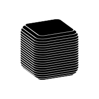

<h3 align="center"> A passionate Software Engineer from finland </h3> &nbsp;

- 🌱 I’m currently learning **Software Engineering in Metropolia UAS** 
 
- 📄 Know about my experiences: [https://kaspaaro.github.io/my-portfolio/](https://kaspaaro.github.io/my-portfolio/) 
- 🔊 My 3D Audio Visualizer! (After premissions, you might need to force Refresh "Ctrl + F5"): [https://kaspaaro.github.io/React_Three.js_Audio_Visualizer/](https://kaspaaro.github.io/React_Three.js_Audio_Visualizer/)
-  ⚡ Fun fact **I love Music**
&nbsp;

  

&nbsp; 

<b>📫 &nbsp; How to reach me </b>

&nbsp;

&nbsp;

&nbsp;

  

<b> 🎯 &nbsp; 
    My Github Stats
    </b>
    

     
    

    
    
    

&nbsp;

<b>💻 &nbsp; Languages and Tools </b>

&nbsp;

 &nbsp;  &nbsp; 
  &nbsp; 
 &nbsp;
 &nbsp;
 &nbsp;
 &nbsp;
 &nbsp;
 &nbsp;
 &nbsp;
 &nbsp;
 &nbsp;
 &nbsp;
 &nbsp;
 &nbsp;
 &nbsp;
 &nbsp;
 &nbsp;
 &nbsp;
 &nbsp;
 &nbsp;
 &nbsp;
 &nbsp;
 &nbsp;
 &nbsp;
 &nbsp;
 &nbsp;
 &nbsp;
 &nbsp;
 &nbsp;
 &nbsp;
 &nbsp;
 &nbsp;
 &nbsp;

&nbsp;

Snake Eating My 2023 Commits

